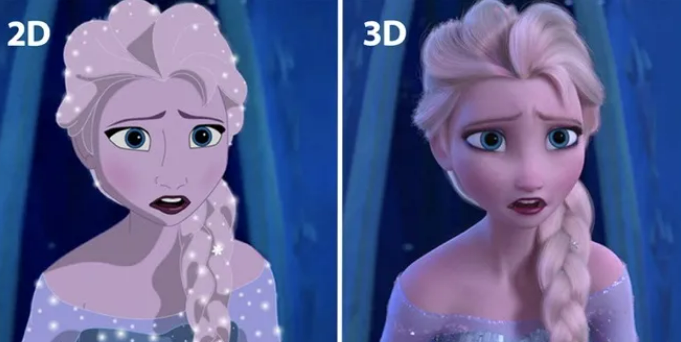
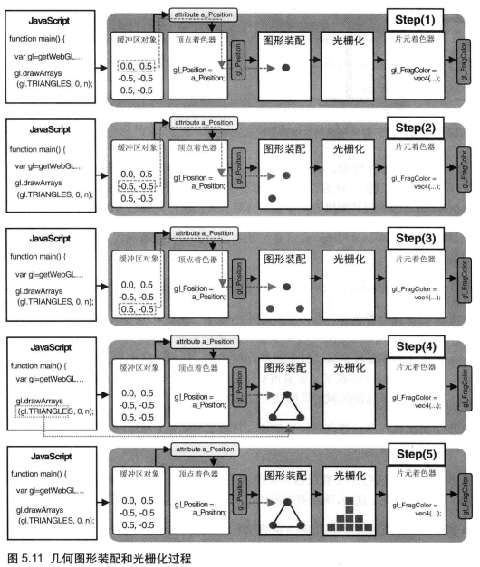
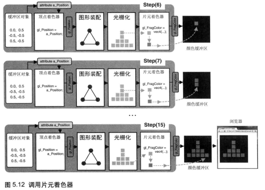

# WebGL 绘制多彩的三角形

> 可用<kbd>F12</kbd>开发者工具查看元素及样式，可打开 codepen 在线编辑代码。

::: demo [vanilla]

```html
<html>
    <canvas id="canvas"></canvas>
    </html>
    <style>
      body {
        margin: 0;
        overflow: hidden;
      }

      #canvas {
        background-color: #911b1b;
      }
    </style>
    <!-- 顶点着色器 -->
    <script id="vertexShader" type="x-shader/x-vertex">
      attribute vec4 a_Position;
      attribute vec4 a_Color;
      varying vec4 v_Color;// varying变量将其全局化，之后可以在片着色器中拿到
      void main(){
          //点位
          gl_Position=a_Position;
          //尺寸
          gl_PointSize=5.0;
          //颜色
          v_Color = a_Color;
      }
    </script>

    <!-- 片元着色器 -->
    <script id="fragmentShader" type="x-shader/x-fragment">
      precision mediump float;
      varying vec4 v_Color;
      void main(){
          gl_FragColor=v_Color;
      }
    </script>
    <script>
      function initShaders(gl, vsSource, fsSource) {
        //创建程序对象
        const program = gl.createProgram();
        //建立着色对象
        const vertexShader = loadShader(gl, gl.VERTEX_SHADER, vsSource);
        const fragmentShader = loadShader(gl, gl.FRAGMENT_SHADER, fsSource);
        //把顶点着色对象装进程序对象中
        gl.attachShader(program, vertexShader);
        //把片元着色对象装进程序对象中
        gl.attachShader(program, fragmentShader);
        //连接webgl上下文对象和程序对象
        gl.linkProgram(program);
        //启动程序对象
        gl.useProgram(program);
        //将程序对象挂到上下文对象上
        gl.program = program;
        return true;
      }

      function loadShader(gl, type, source) {
        //根据着色类型，建立着色器对象
        const shader = gl.createShader(type);
        //将着色器源文件传入着色器对象中
        gl.shaderSource(shader, source);
        //编译着色器对象
        gl.compileShader(shader);
        //返回着色器对象
        return shader;
      }
      const canvas = document.querySelector("#canvas");
      canvas.width = 600;
      canvas.height = 150;

      // 获取着色器文本
      const vsSource = document.querySelector("#vertexShader").innerText;
      const fsSource = document.querySelector("#fragmentShader").innerText;

      //三维画笔
      const gl = canvas.getContext("webgl");

      //初始化着色器
      initShaders(gl, vsSource, fsSource);

      //顶点数据
      const vertices = new Float32Array([
        -0.25,
        -0.25,
        1,
        0,
        0,
        1, //红
        0,
        0.25,
        0,
        1,
        0,
        1, //绿
        0.25,
        -0.25,
        0,
        0,
        1,
        1, //蓝
      ]);

      //元素字节数
      const elementBytes = vertices.BYTES_PER_ELEMENT;
      //系列尺寸
      const verticeSize = 2;
      const colorSize = 4;
      //类目尺寸
      const categorySize = verticeSize + colorSize;
      //类目字节数
      const categoryBytes = categorySize * elementBytes;
      //系列字节索引位置
      const verticeByteIndex = 0;
      const colorByteIndex = verticeSize * elementBytes;
      //顶点总数
      const sourceSize = vertices.length / categorySize;

      //缓冲对象
      const vertexBuffer = gl.createBuffer();
      //绑定缓冲对象
      gl.bindBuffer(gl.ARRAY_BUFFER, vertexBuffer);
      //写入数据
      gl.bufferData(gl.ARRAY_BUFFER, vertices, gl.STATIC_DRAW);
      //获取attribute 变量
      const a_Position = gl.getAttribLocation(gl.program, "a_Position");
      //修改attribute 变量
      gl.vertexAttribPointer(
        a_Position,
        verticeSize,
        gl.FLOAT,
        false,
        categoryBytes,
        verticeByteIndex
      );
      //赋能-批处理
      gl.enableVertexAttribArray(a_Position);

      //颜色

      //获取attribute 变量
      const a_Color = gl.getAttribLocation(gl.program, "a_Color");
      //修改attribute 变量
      gl.vertexAttribPointer(
        a_Color,
        colorSize,
        gl.FLOAT,
        false,
        categoryBytes,
        colorByteIndex
      );
      //赋能-批处理
      gl.enableVertexAttribArray(a_Color);

      //声明颜色 rgba
      gl.clearColor(255, 255, 255, 1);
      //刷底色
      gl.clear(gl.COLOR_BUFFER_BIT);

      //绘制矩形面
      gl.drawArrays(gl.TRIANGLES, 0, 3);
    </script>
</html>
```

:::

Demo 在线地址：[https://codepen.io/东流/pen/OJGpzMJ](https://codepen.io/东流/pen/OJGpzMJ)

### 2D 与 3D

2D 和 3D 可能会被认为是世界不同等级维度，比如纸片人和三维空间，实际上它们主要是人们对于对象的不同特征的描述方式。
2D 表示对象的宽度和高度这两个平面特征，而 3D 除了表示对象的平面特征之外，还包含对象空间特征深度属性。比如下面两张图都只是一个平面上的图形，但是分别描述了对象的不同特征，从而给我们带来了不同的 2D 和 3D 视觉上的不同感受。




### `WebGL` 和 `Canvas` 的比较

`Canvas`： `canvas` 使用 2D 渲染上下文来绘制图形和图像，是基于像素的绘图系统，通过 Javascript 脚本控制渲染过程
`WebGL`： 基于 OpenGL ES 标准的 Javascript API，可以利用 GPU 进行硬件加速的 3D 图像渲染，需要使用着色器编程（`shaders`）

### WebGL 介绍

`WebGL`，即 Web Graphics Library，是一种 3D 绘图协议，这一技术标准允许把 JavaScript 和 OpenGL ES 2.0 结合在一起，为 HTML5 Canvas 提供硬件 3D 加速渲染

#### 着色器语言

着色器用 `GLSL ES`（OpenGL Shading Language）语言编写，是一种强类型编程语言，语法和 C 语言有些类似，是在 OpenGL 的基础上进行了一定的精简，开发者可以通过着色器控制 GPU 来进去前端图形的渲染。

着色器分为顶点着色器（`Vertex shader`）和片元着色器（`Fragment shader`）

- 顶点着色器：用于描述顶点特性如位置、颜色等

- 片元着色器：进行逐片元处理过程如光照的程序

示例中的着色器如下

```html
<!-- 顶点着色器 -->
<script id="vertexShader" type="x-shader/x-vertex">
  attribute vec4 a_Position; // 存储限定符，只有顶点着色器可以使用，其类型只能是float、vec2、vec3、vec4、mat2、mat3、mat4
  attribute vec4 a_Color;
  varying vec4 v_Color;// varying变量将其全局化，之后可以在片着色器中拿到，类型同上
  void main(){
      //点位
      gl_Position=a_Position;
      //尺寸
      gl_PointSize=5.0;
      //颜色
      v_Color = a_Color;
  }
</script>

<!-- 片元着色器 -->
<script id="fragmentShader" type="x-shader/x-fragment">
  precision mediump float;
  varying vec4 v_Color;
  void main(){
      gl_FragColor=v_Color;
  }
</script>
```

#### 渲染管线

渲染管线，就是图形渲染的过程，主要分为五个阶段：

1.顶点着色器阶段（`Vertex Shader Stage`）：顶点着色器对传入的顶点数据进行处理，通常用来进行坐标变换、光照计算等操作。

2.几何着色器阶段（`Geometry Shader Stage`）：几何着色器可以对图元进行进一步处理，生成新的顶点数据或者直接生成图元。

3.光栅化阶段（`Rasterization Stage`）：将图元转换为屏幕上的像素点。

4.片元处理阶段（`Fragment Processing Stage`）：对每个像素点进行处理，包括应用纹理、光照计算、颜色插值等操作。

5.像素操作阶段（`Pixel Operations Stage`）：最后对像素进行深度测试、模板测试、颜色混合等操作。





### 三角形是怎样出来的

#### 颜色值的内插

在顶点着色器中向 `varying` 变量 `v_Color` 赋上这两个颜色（红色和蓝色），`WebGL` 会自动地计算出线段上的所有点（片元）的颜色，并赋值给片元着色器中的`varying` 变量 `v_Color`


线段上的所有片元的颜色值都会被恰当地计算出来——这个过程就被称为内插过程（interpolation process）
